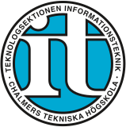

<h1 style="border-bottom: 0;">Teknologsektionen Informationsteknik Software Engineering (IT)</h1>
<a href="https://dokument.chalmers.it/">Documents</a> -
<a href="https://wiki.chalmers.it/">Wiki</a> -
<a href="https://chalmers.it/">Homepage</a> -
<a href="https://digit.chalmers.it/">digIT</a> -
<a href="https://findit.chalmers.it/">Find services</a>

____

This is the GitHub organization for the open-source projects from IT-section on Chalmers University of Technology.
Our services are maintained and developed by digIT (and sometimes also didIT).
